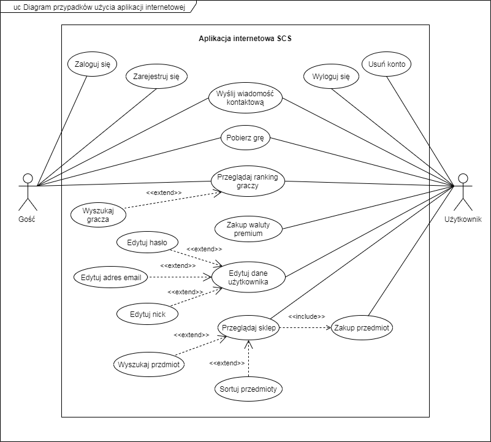
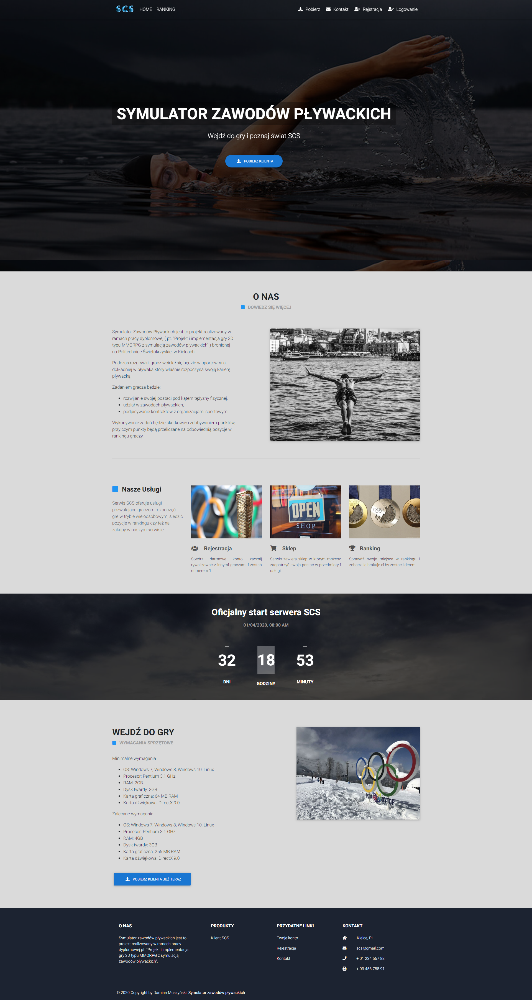
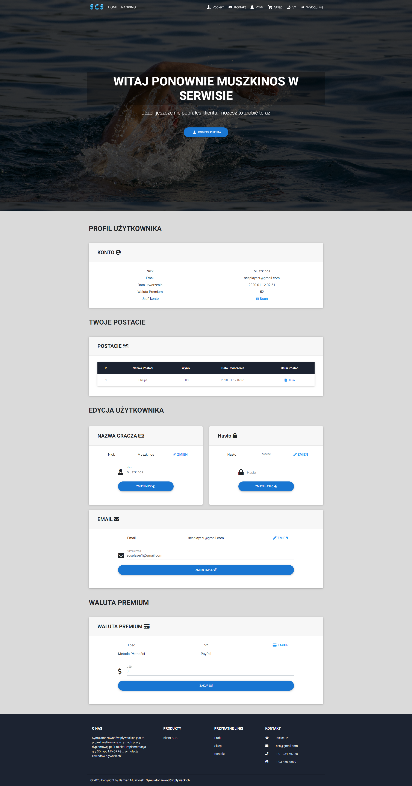
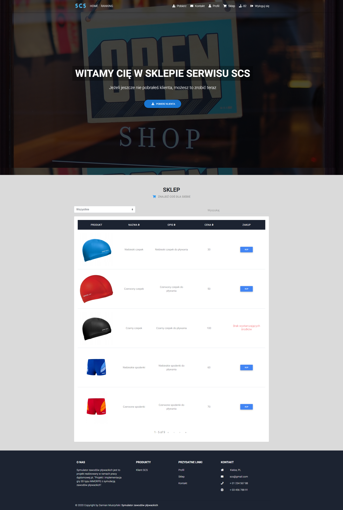
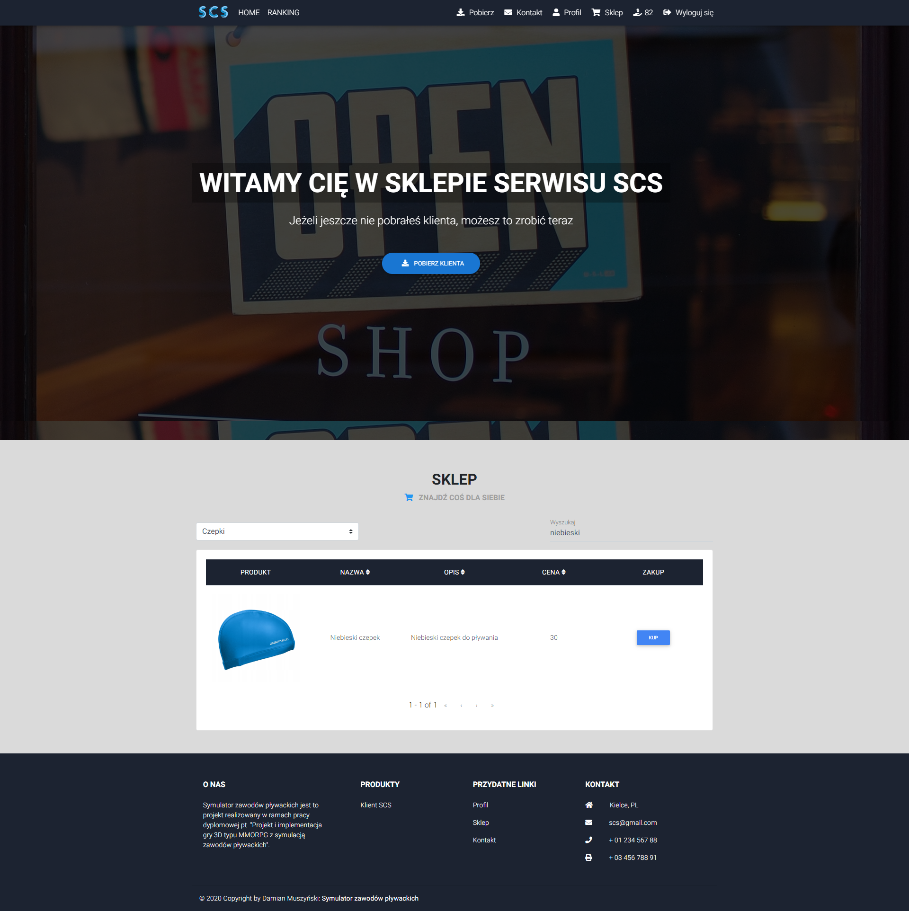
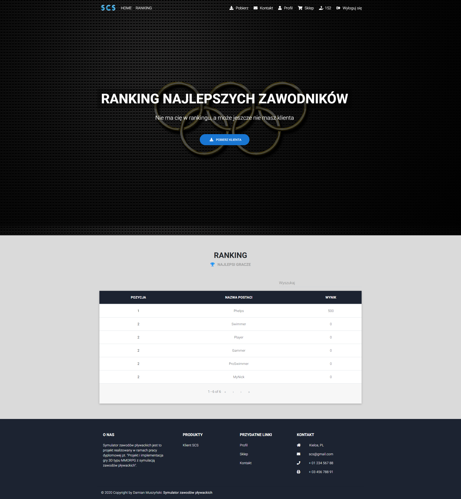

# Swimming Competition Simulator (SCS) Web Application
Web application for 3D MMORPG game 

<h2>Use Case Diagram</h2>

<h2>View</h2>
The view shows the elements of the application interface

<h3>Home page</h3> 

 <h3>User profile page</h3> 

 <h3>Shop unselected options page</h3> 

 <h3>Shop selected options page</h3> 

 <h3>Character ranking page</h3> 

<h3>Navigation unlogged user</h3>

<h3>Navigation logged user</h3>

