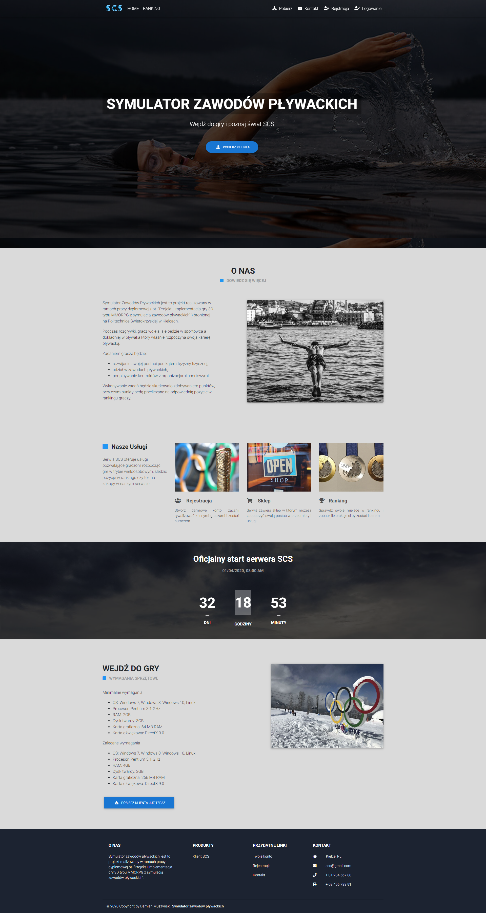
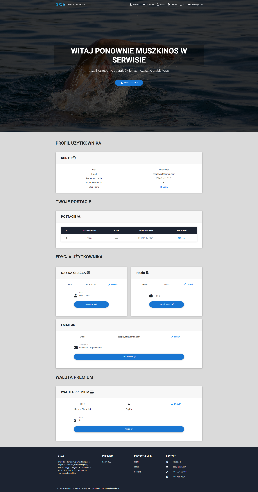
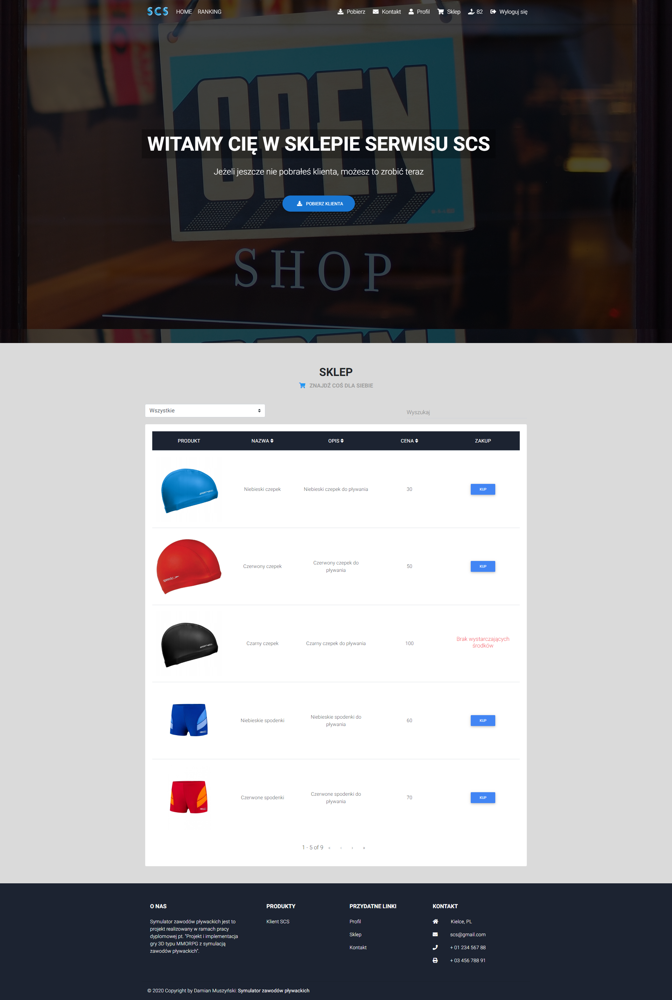
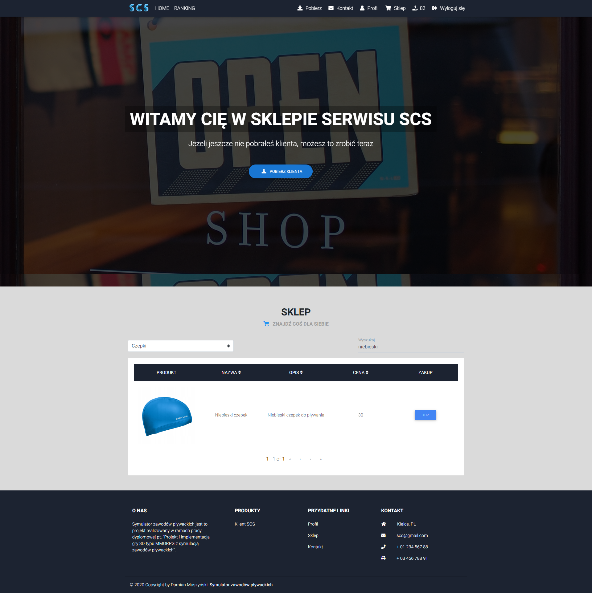
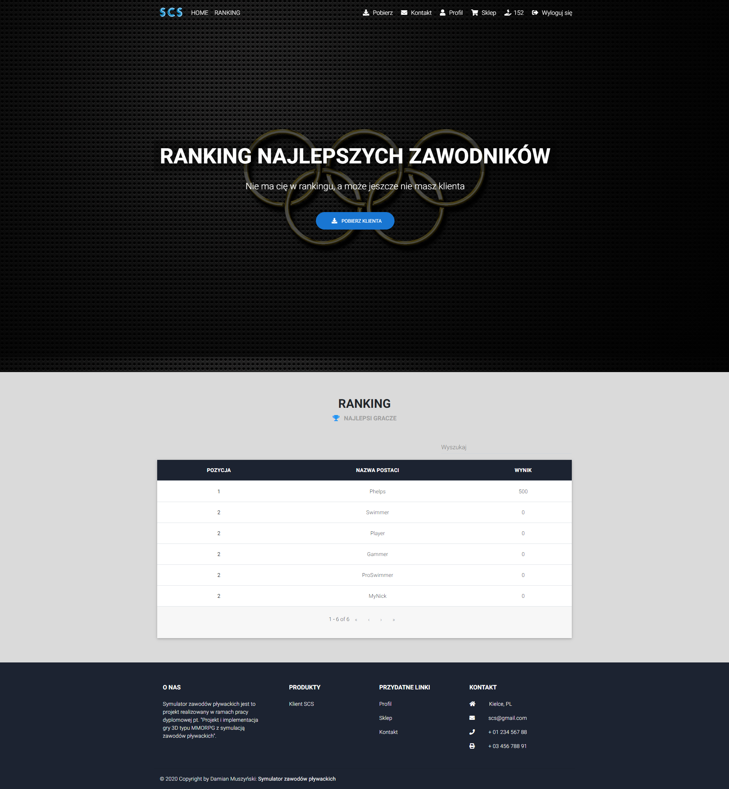
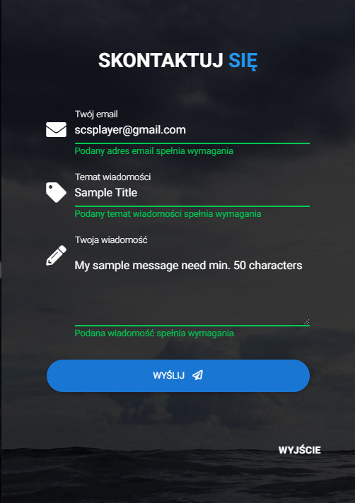
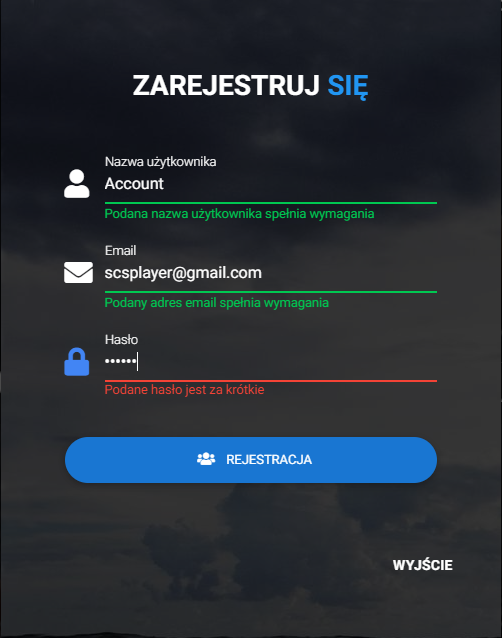
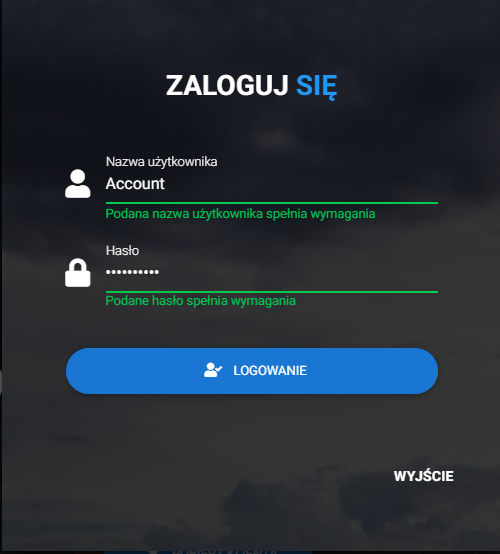

# Swimming Competition Simulator (SCS) Web Application
Web application for 3D MMORPG game 

<h2>View</h2>
The view shows the elements of the application interface.

<h3>Home page</h3>
The home page provides example information about a simulation game.  

<h3>User profile page</h3>
The user's profile page stores information about the user and allows the exchange of personal data, the purchase of a virtual currency via PayPal.  

<h3>Shop unselected options page</h3>
The online store website offers search, sorting and buying services for items later available in the simulation game.  

 <h3>Shop selected options page</h3> 

 <h3>Character ranking page</h3> 

<h3>Navigation unlogged user</h3>

<h3>Navigation logged user</h3>

 <h3>Download modal</h3> 

 <h3>Contact modal</h3> 

 <h3>Register modal</h3> 

 <h3>Login modal</h3> 

